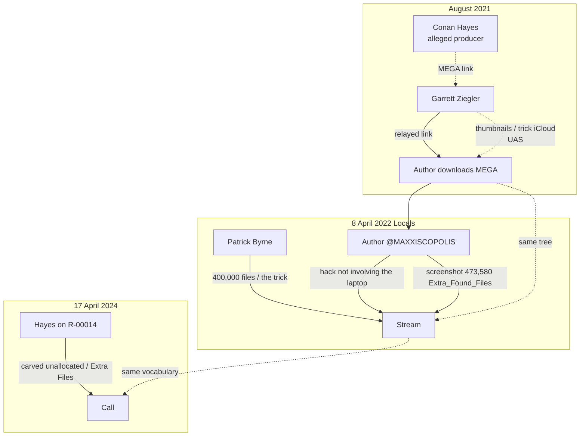

# Circular custody — Ziegler, the author, Byrne, and “the trick”

> **Hatnote.** This page is a **graded claim**, not a closed loop. It exists because three independent-looking statements use the same recovery idea in the same eight-month window, and because Extra Found Files is the only hashed pile that matches the story.

## The one sentence

> In **August 2021** Ziegler shared **Hayes’s MEGA link** with the author (first person **known** to download) and (the author recalls) said Hayes had **tricked iCloud with laptop thumbnails**. In **April 2022** the author posted a screenshot of that tree on Byrne’s Locals stream and wrote “**hack not involving the laptop**”; Byrne, on the same stream, said he had ~**400,000** recovered files and that the FBI might not have done “**the trick** you’ve got to do to recover the hidden files.” Hayes, in **April 2024**, said he **carved deleted files from unallocated space**. Those four statements are the **same allegation in four mouths**. Hash tables show 0728 is **not** a clone of JPMI/APFS/GAI. Together they **bolster the timeline**; they do **not** replace SHA-256.

## Diagram

[Source file](diagrams/circular_custody.mmd).

## Vertex A — Hayes → Ziegler → author (August 2021)

**Established:** Hayes’s MEGA link relayed by Ziegler; author download — **first person known** on that share; Ziegler named Hayes as upstream.

**Attributed, not natively logged:** “used thumbnails to trick iCloud into giving up the higher resolutions.” Class: **participant recollection (author of Ziegler)**. [Garrett Ziegler](GARRETT_ZIEGLER.md).

## Vertex B — Locals, 8 April 2022

**Established (archived MP4 + chat JSON):**

- Byrne: I **have** ~400,000 deleted files; someone with a forensic image recovered them; **the trick** to recover hidden files.
- Author: hack **not involving the laptop**; screenshot of **473,580** files, folder created **5 Aug 2021**.

Hosted stills:

- [Extra Found Files Properties](exhibits/locals/extra_found_files_properties_473580.jpg)
- [Byrne holding a portable drive](exhibits/locals/byrne_holding_portable_drive.jpg)
- [Chat: hack not involving the laptop](exhibits/locals/chat_maxxiscopolis_hack_not_laptop.jpg)

Canonical stream: https://locals.com/patrickbyrne/feed?post=1966482  
[Patrick Byrne](PATRICK_BYRNE.md) · [Jack Maxey](JACK_MAXEY.md) (size rumor in the same chat).

## Vertex C — Hayes carving (17 April 2024)

**Established (audio):** Extra Files “deleted”; “brought them back to life”; “white space” / unallocated. [R-00014](R00014_CALL.md).

## Vertex D — the hash remainder (why the circle is worth drawing)

If Extra Files were only leftover laptop bytes, the [unmatched](UNMATCHED_HASHES.md) **94,635** hashes and the [23-image](TWENTY_THREE_IMAGES.md) **larger-than-laptop** JPEGs would not exist. The “trick / hack / carve” vocabulary is the **human-side hypothesis** for that remainder. [Informant theory](INFORMANT_THEORY.md) is the **cover-identity** hypothesis for why Hayes was imaging things under someone else’s name weeks earlier.

## What “circular” does **not** mean

It does **not** mean the four people hashed the same drive together on camera. It means:

1. the **same recovery story** (hidden/deleted/trick/carve/cloud) repeats;
2. the **same order-of-magnitude file count** repeats;
3. the author’s screenshot is **his own 0728 tree**, already in hand before Byrne spoke;
4. Byrne’s “I have them” is a **parallel possession claim**, not a second download log.

A closed custody circle would need Byrne’s native inventory hashed against `0728://`. That has not been done here.

## Kitchen-table analogy

Four people describe a photocopier that **throws away folder labels** and sometimes **prints a bigger picture than the one in the house album**. You still have to fingerprint the prints. The matching prints are the laptop. The unmatched prints are why investigators keep the “trick” story on the table.

## See also

- [Chain of custody](03_chain_of_custody.md)
- [Integrity](INTEGRITY.md)
- [July 28 burst](JULY_28_BURST.md)
