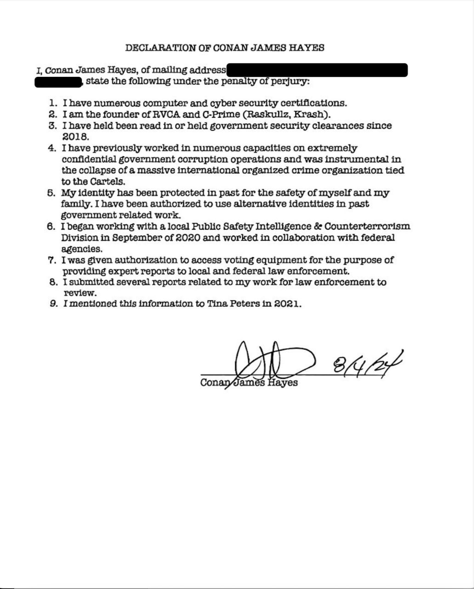

# Informant theory (and why it belongs on the 0728 page)

> **Hatnote.** This is the **cover-identity / federal-protection** file. It is not a finding that Hayes was a **registered FBI confidential informant (CHS)**. Hosted here is Hayes’s **signed affidavit** of **4 August 2024** (paper title: *Declaration of Conan James Hayes*). On R-00014 he also said he worked with **Homeland** and helped the **FBI on Backpage**, coming **in and out**. That is, at minimum, an **asset** self-description. The same story explains why Hayes hid his name in May 2021 — weeks before Extra Found Files materialized.

## The one sentence

> **Hayes signed an affidavit under penalty of perjury that his identity was protected, that he had used alternative identities in government-related work, and that he told Tina Peters this in 2021.** On tape he said he worked for Homeland and helped the FBI on Backpage, **coming in and out**. That is **at least an asset**. The Peters jury never heard it. This encyclopedia does, because 0728’s unmatched, stripped-name dump is the next place that same person shows up with a “I carved deleted files” story.

If you only wanted a hash table, you could skip this page. The **origin question** is not only “which disk.” It is “who was allowed to image things, under what cover, and what else could that access produce.”

## Hayes’s signed affidavit (4 August 2024)

**This is the primary paper on this page.** It is a photographed typed statement titled **DECLARATION OF CONAN JAMES HAYES**. Hayes states the contents **under the penalty of perjury**. A signature over the printed name **Conan James Hayes** sits next to the handwritten date **8/4/24**. The mailing address is **redacted** on this copy. The paper is **not notarized** on its face; this encyclopedia still treats it as Hayes’s **signed affidavit** — his own sworn-style statement, not Peters’s lawyers restating him.

The photograph was saved as `photo_2024-08-13_18-15-38.jpg` (**13 August 2024, 18:15:38**) — the day after the Peters verdict. That is the **photo** date, not the signature date. The encyclopedia copy is [`hayes_signed_affidavit_2024-08-04.jpg`](exhibits/fbi/hayes_signed_affidavit_2024-08-04.jpg) (same bytes).

| File | SHA-256 |
|---|---|
| [`hayes_signed_affidavit_2024-08-04.jpg`](exhibits/fbi/hayes_signed_affidavit_2024-08-04.jpg) | `f13389104f0de71bc59f9bf35a743e8b7d522188b0672fb9eff654d86b6f0ab6` |
| [`photo_2024-08-13_18-15-38.jpg`](exhibits/fbi/photo_2024-08-13_18-15-38.jpg) (original filename) | same |

**Nine numbered points, as written** (awkward grammar preserved):

1. Numerous computer and cyber security certifications.
2. Founder of **RVCA** and **C-Prime** (Raskullz, Krash).
3. “I have held been read in or held government security clearances since 2018.”
4. Worked “in numerous capacities on extremely confidential government corruption operations” and was “instrumental in the collapse of a massive international organized crime organization tied to the Cartels.”
5. Identity “protected in past” for safety of himself and family; “authorized to use alternative identities in past government related work.”
6. Began working with a local **Public Safety Intelligence & Counterterrorism Division** in **September of 2020** and “worked in collaboration with federal agencies.”
7. “Given authorization to access voting equipment for the purpose of providing expert reports to local and federal law enforcement.”
8. Submitted several reports related to that work for law enforcement to review.
9. “I mentioned this information to Tina Peters in 2021.”

**Class.** Photographed signed affidavit / declaration — **participant account on paper**. Weaker than a certified court original.

**What the paper does not say.** It does **not** use the words “FBI informant,” “CHS,” or “Backpage.” Those labels are on R-00014 (Backpage / Homeland / come in and out) and in Peters’s counsel filing (federal informant / Back Page).

**Limitation.** An affidavit under penalty of perjury is still **Hayes’s claim**. The Peters trial court rejected a Hayes declaration of this kind; the prosecutor told the court the FBI confirmed Hayes was never an informant. This photograph does not convert the claim into a CHS file. It **does** put Hayes’s own signed paper in this encyclopedia instead of treating the bond motion as the only primary.

Parent-project research had treated the declaration as described in a defense appellate brief pending acquisition. This photo is the **project-held image** of that paper.

## What Peters’s lawyers put in a court filing

On **17 November 2024**, Peters’s *Motion for Bond Pending Appeal* (Colo. App. 2024CA1951) stated:

> “Hayes insisted that his identity not be disclosed because he claimed he was hunted by criminal cartels for his role as a **federal informant in taking down Back Page**, which was an internet-based child trafficking operation. To protect Hayes’ identity, Appellant arranged for … Gerald Wood to apply for and obtain a Mesa County keycard … The district court excluded evidence of Hayes’ involvement as a federal informant.”

PDF: https://tinapeters.us/wp-content/uploads/2024/12/11-17-2024-Motion-for-Bond-on-Appeal.pdf

That is **Peters’s appellate counsel** restating **Hayes’s claimed status**, with the **Backpage** label the signed **affidavit** does not use. Trial reporting matches the same theory ([Courthouse News](https://www.courthousenews.com/colorado-elections-clerk-guilty-on-most-charges-over-voting-machine-data-leak/), [AP](https://apnews.com/article/tina-peters-colorado-election-clerk-trial-a09d1841dfdfb0d86abe0018f0025c53)).

Peters told Judge Barrett she understood she was “not allowed to tell the jury that Conan Hayes in fact was a government informant, but I concealed his identity to protect him.” She then declined to testify.

Read the two documents and the call as **one motif, three wordings**: Hayes’s **affidavit** says cartels, alternative identities, voting-equipment authorization, and that he told Peters in 2021. Hayes’s **voice** on R-00014 names **Homeland**, **FBI**, **Backpage**, and **come in and out**. Peters’s lawyers named **federal informant** and **Backpage**.

## What the prosecutor and FBI said

Mesa County DA **Dan Rubinstein** told the court the **FBI confirmed Hayes was never an informant** ([GJ Sentinel](https://www.gjsentinel.com/news/western_colorado/the-former-pro-surfer-at-the-heart-of-the-peters-case/article_b365a8a8-568a-11ef-8e34-cba735066202.html)). Judge Barrett excluded the theory as irrelevant and prejudicial.

Those statements **do not disappear the claim**. They are the **rebuttal to the word “informant.”** They do not answer Hayes’s own Backpage / Homeland / “come in and out” account. This encyclopedia prints both.

## What Hayes told this author (R-00014) — Homeland, FBI, Backpage

On 17 April 2024 Hayes said, in his own voice ([clip](exhibits/audio/R-00014_fbi_backpage.mp3)):

> “Before the election I was working for Homeland, so, you know, I think they know who I am. I've worked, you know, like I helped FBI on Backpage case. Like, I come in and out. Like, I'm not associated or affiliated, but if they want to take down, like, child predators, I— in the past, I had no problem helping them.” — **00:25:07**

He added that a Homeland **contract** (border-related, in his telling) was cancelled after a budget cut. — **00:25:49**

**Observed fact.** Hayes claimed **Homeland** work and **on-and-off** FBI help on **Backpage** (“come in and out”). He denied being “associated or affiliated.”

**Interpretation.** That is the ordinary description of an **asset**: used when wanted, not a badge, not a payroll employee, not a registered CHS file. Peters’s lawyers later named **federal informant** and **Backpage**. Hayes named **Backpage** and **come in and out** himself. The **4 Aug 2024 affidavit**’s cartel / alternative-identity paragraphs are the same motif without those two words. [R-00014](R00014_CALL.md) · [Glossary](GLOSSARY.md).

**Limitation.** This is **Hayes’s self-report**. It is not a handler name, case number, or Bureau classification held in this repo. The Peters prosecutor’s recitation that the FBI confirmed Hayes was **never an informant** can sit next to asset use: agencies deny **CHS** while still taking walk-in help, contractors, and off-books assistance. “Never an informant” is not the same sentence as “never helped on Backpage.”

He did **not** say “registered CHS.” He **did** claim the work Peters said she was protecting.

## What the FBI paperwork shows (not CHS)

FD-597 **13 Sep 2022**: iPhone **Received From** Hayes; biometric-warrant excerpt; SA Calum Ramm. [Phone seizure](PHONE_SEIZURE.md). That is **contact and custody**, not a CHS file. It is also not a denial of asset use.

## How this attaches to 0728

| Date | Event |
|---|---|
| Sep 2020 | Declaration ¶6: local Public Safety Intelligence & Counterterrorism; collaboration with federal agencies (**Hayes’s claim**) |
| May 2021 | Hayes images Mesa County EMS under a **borrowed name**, citing (per Peters) federal-informant danger; declaration ¶9 says he told Peters this information in 2021 |
| 28–29 Jul 2021 | Extra Found Files **materializes** — stripped names, mixed matched/unmatched hashes |
| Aug 2021 | Ziegler tells the author Hayes **“tricked” iCloud** using laptop thumbnails ([Ziegler](GARRETT_ZIEGLER.md)) |
| Apr 2022 | Byrne: “the **trick** you’ve got to do to recover the hidden files”; author: “hack **not involving the laptop**” |
| Apr 2024 | Hayes: carved **unallocated space**; Homeland / FBI / Backpage “come in and out” (**at least an asset**) |
| **4 Aug 2024** | Hayes signs the **affidavit** (*Declaration of Conan James Hayes*: cartels, alternative identities, voting-equipment access, told Peters in 2021) |
| 12–13 Aug 2024 | Peters verdict; this photograph timestamped **13 Aug 2024 18:15:38** |

The informant/cover story is **not proof** that 0728 is a hack. It is the **operational pattern**: Hayes presents as someone who (a) needs identity cover, (b) performs “forensic images,” (c) later describes Extra Files as resurrected deleted data, while **94,635 hashes** do not match the three laptop-lineage catalogs. Those facts belong on one page so a reader can see why “just a repair-shop leftover” is the claim under test. [Unmatched hashes](UNMATCHED_HASHES.md) · [Circular custody](CIRCULAR_CUSTODY.md).

## Claims this page does **not** make

- that Hayes was a **registered** confidential informant / CHS (the Bureau classification);
- that “asset” appears as a label in an FBI file held here — it is this encyclopedia’s gloss of Hayes’s “come in and out” / Backpage / Homeland words;
- that Backpage tasking is documented in FBI files held here;
- that the **affidavit**’s “authorization to access voting equipment” was lawful Mesa County process (Wood’s badge was the court-recited mechanism);
- that Mesa County images are inside 0728 (they are not compared here);
- that federal protection authorized Extra Found Files.

## See also

- [Exhibits](EXHIBITS.md)
- [Tina Peters](TINA_PETERS.md)
- [Conan Hayes](CONAN_HAYES.md)
- [Integrity](INTEGRITY.md)
