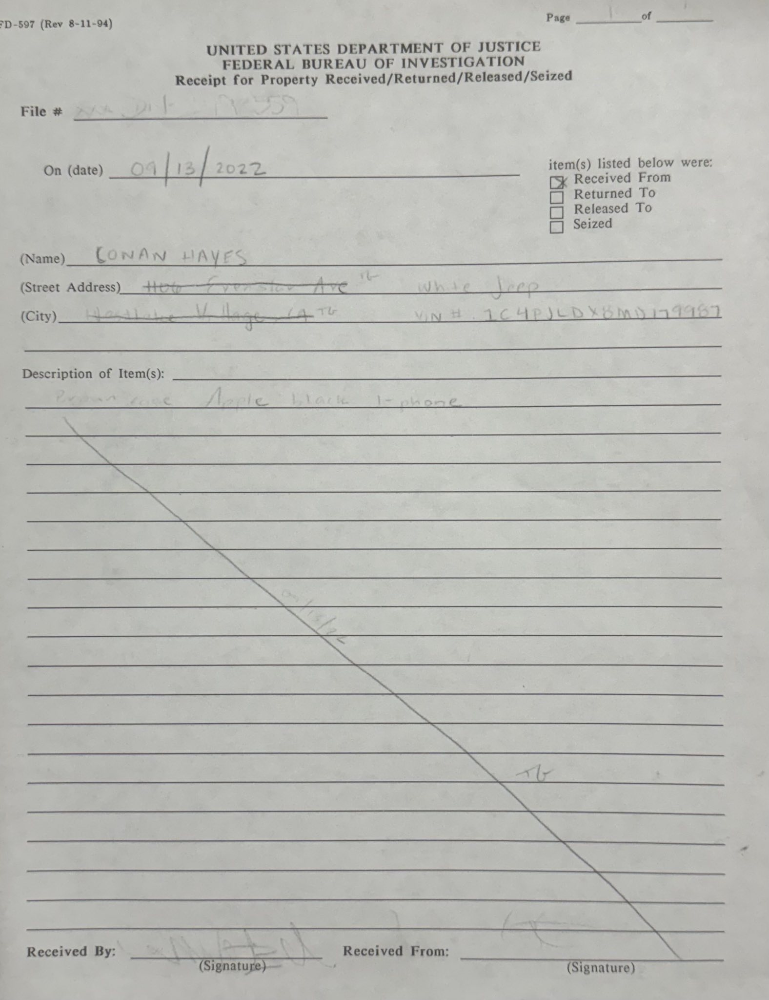
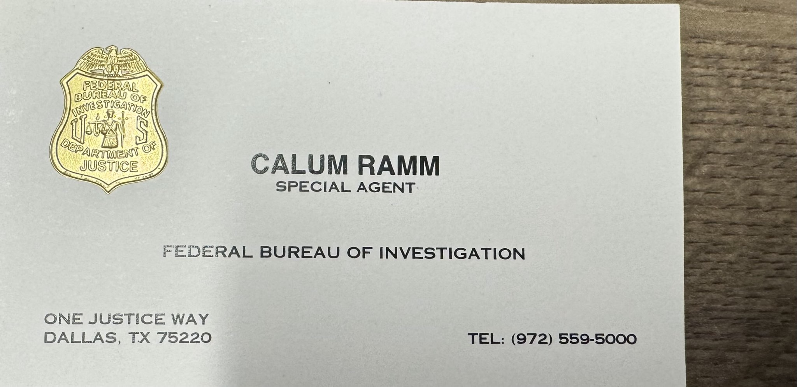

# Phone seizure — 13 September 2022

> **Hatnote.** FBI paperwork photographs transmitted via Signal, plus Hayes’s R-00014 story. Exhibits: [catalog](catalog/exhibits.md). Not a complete warrant file.

## Photographed FD-597

| Field | As visible on the exhibit |
|---|---|
| Form | FBI Receipt for Property Received/Returned/Released/Seized (FD-597) |
| Date | **09/13/2022** |
| Name | **CONAN HAYES** |
| Checkboxes | **Received From** checked; **Seized** not checked |
| Item | Brown case, Apple black iPhone |
| Vehicle | White Jeep, VIN `1C4PJLDX8MD179987` |
| File # | Partially visible (`xxx-DN-173559` class) |
| SHA-256 | `469550cdead9b66ed6d9cf10273698602ecc11c7b8f96e056d19eafa5effd8ad` |

**Observed fact:** the Bureau recorded a custody transaction naming Hayes and an iPhone. **Limitation:** this is a photograph of a form, not a certified copy; signatures and full file number are not reliably readable.

“Received From” rather than “Seized” supports a **cooperative physical handover**. It does not convert compliance with a warrant into Fourth Amendment consent to forensic search.

## Named agent

Special Agent **Calum Ramm**, FBI Dallas, One Justice Way, (972) 559-5000. Handwritten `cwramm@fbi.gov` on FBI stationery in the same set.

## Biometric-warrant excerpt

The fourth image is **page viii** of a warrant excerpt: law enforcement may use Hayes’s fingerprint and face to unlock the **HAYES CELLPHONE** during execution; *Graham v. Connor* force limits. It does **not** publish the affidavit, attachments, or return.

Hayes’s R-00014 story — agent power-cycles the phone, biometrics fail, passcode not in the warrant — is **consistent with** a biometric-only unlock clause. Consistency is not proof that this excerpt is the warrant served in the van.

## Two motive stories

| Hypothesis | Support on this record | Limitation |
|---|---|---|
| Trump call → Mar-a-Lago → phone stop | Hayes’s words on R-00014 | Date: FD-597 is **13 Sep 2022**, not “a week” after 8 Aug; no 302s |
| Mesa County / Lindell images investigation | **Same day** Lindell phone seized; Hayes imaged Mesa County server May 2021 | Still not the FBI file |

This encyclopedia **preserves both** and labels the Mesa County pairing as the stronger **documentary coincidence**, not a closed finding.

## Informant status

These papers show **FBI contact and property receipt**. They are **not** a CHS file. Hayes’s R-00014 Backpage / Homeland / “come in and out” account is **at least an asset**; it is a different record than these photos. Hayes’s **4 Aug 2024 signed affidavit** is his own cover-identity claim on paper. The Peters prosecutor’s “never an informant” recitation is a trial statement about the word **informant**, not a published denial of Backpage help. [Informant theory](INFORMANT_THEORY.md) · [Tina Peters](TINA_PETERS.md).

## See also

- [R-00014](R00014_CALL.md)
- [Exhibits](EXHIBITS.md)
- [Conan Hayes](CONAN_HAYES.md)
